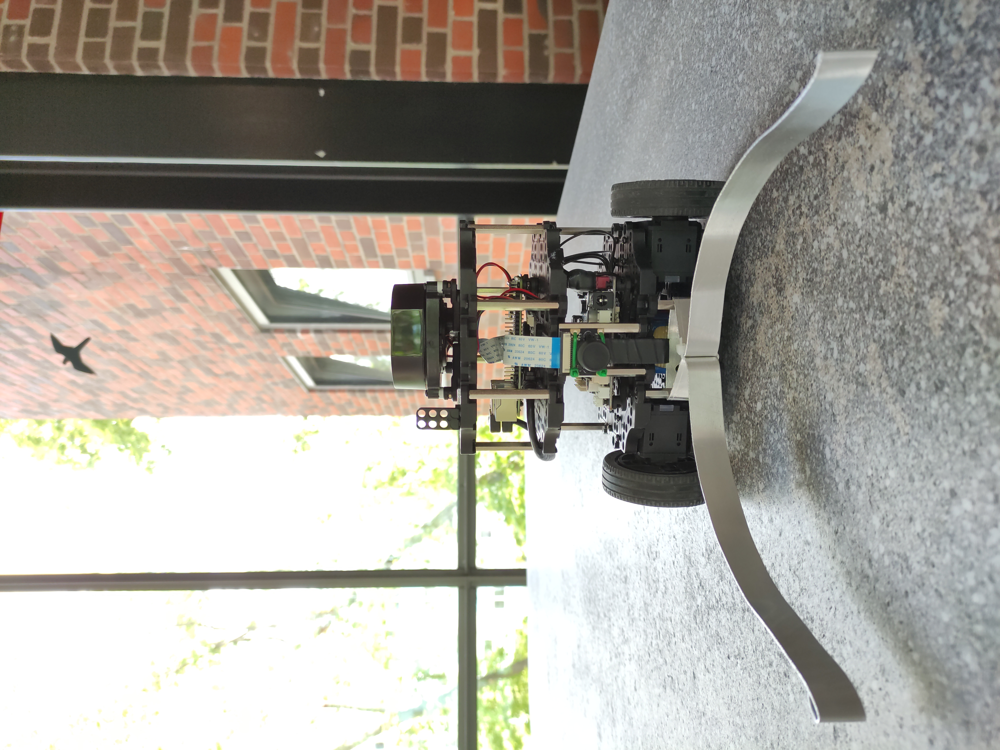

# Ball 🥎 Schubser 🤖

A robot 🤖 that pushes a ball 🥎 (into a goal 🥅).

[](media/ball-schubser_front_1.jpg)

## Startup Instructions

1. git pull
2. Inside `.env` add `MASTER_IP=<your-ip>`
3. Run `docker-compose up -d --remove-orphans`
4. Start Turtlebot and connect to via SSH `ssh ubuntu@192.168.31.4` with default password: `turtlebot`
5. Set `export ROS_MASTER_URI=<your-ip>`
6. Run `sh ~/launch.sh`
7. Run `sh ~/cam.sh`
 
### Simplified

1. git pull
2. execute `export BIP=<your bots ip> && export MIP=<your pc ip>`
3. execute `make everything`

## Some ROS Commands

- ui: `rqt`
- list all packages: `rospack list-names`
- build packages inside `~/catkin_ws`: catkin_make
- start master: `roscore`

## Turtlebot 🐢 Configuration

Connect via SSH `ssh ubuntu@192.168.31.4` with default password: `turtlebot`

```bash
export TURTLEBOT3_MODEL=burger
export ROS_MASTER_URI=192.168.168.5
roslaunch turtlebot3_bringup turtlebot3_core.launch # bring-up cmd without LIDAR sensor
```

Manual start for webcam:

```bash
ssh ubuntu@192.168.168.4
roslaunch
roslaunch usb_cam usb_cam-test.launch
roslaunch turtlebot3_bringup turtlebot3_core.launch # or turtlebot3_robot.launch
```

## (Local) Network Configuration

Turtlebot and PC have a static IP configured:

* Turtlebot IP: `192.168.31.4`
* Remote PC IP: `192.168.31.5` (master)

They are connected to the lab router with SSID: `ParadiseCity`.

Refer to [Network Manager YML](turtlebot/50-cloud-init.yaml).

## Detection Node

Download weights for yolov4 https://github.com/AlexeyAB/darknet/releases/download/darknet_yolo_v3_optimal/yolov4.weights
Move the weights into detect/yolo_node/weights.

Dependencies:

* tensorflow
* pandas
* opencv-python

## Lessons Learned

* The default user `ubuntu` on the Turtlebot image does not have the proper `tty` permissions. The problem could be solved by adding `ubuntu` to `root` user group, by executing: `sudo usermod -aG root ubuntu`, as the normal group used for that called `dialout` was not set for `tty`.
* ROS machines must have a resolved DNS name as they communicate with each other, see: http://wiki.ros.org/ROS/NetworkSetup

## Raspi cam

```

sudo apt install libraspberrypi-dev libraspberrypi0 libpigpiod-if-dev ros-noetic-compressed-image-transport ros-noetic-camera-info-manager ros-noetic-diagnostic-updater

cd ~/catkin/src
git clone https://github.com/UbiquityRobotics/raspicam_node
catkin_make

# to start raspi cam run following script in home
./cam.sh
```

## Raspberry Pi Preparation

To prepare the image for the Raspberry Pi follow these instructions: https://emanual.robotis.com/docs/en/platform/turtlebot3/sbc_setup/#sbc-setup

After the micro SD card is ready, boot it from your Turtlebot, connect via SSH: `ssh ubuntu@<TURTLEBOT IP>` and do the following:

1. Run: `sudo usermod -aG root ubuntu` to make the user root (see Lessons Learned).
2. Add your network to the `/etc/netplan/50-cloud-init.yaml` or prepare and copy it via SCP: `scp 50-cloud-init.yaml ubuntu@<TURTLEBOT IP>:/etc/netplan/50-cloud-init.yaml`.
3. Edit: `nano ~/.bashrc` to add the below variables and: `source ~/.bashrc`.
   
   ```bash
   export ROS_MASTER_URI=http://<REMOTE PC IP>:11311
   export ROS_HOSTNAME=<TURTLEBOT IP>
   ```

4. Install Raspberry Pi Cam and dependencies with the following commands:
   
   ```bash
   sudo apt install libraspberrypi-dev libraspberrypi0 libpigpiod-if-dev ros-noetic-compressed-image-transport ros-noetic-camera-info-manager ros-noetic-diagnostic-updater
   cd ~/catkin/src
   git clone https://github.com/UbiquityRobotics/raspicam_node
   catkin_make
   ```

5. Run: `export TURTLEBOT3_MODEL=Burger` to set the Turtlebot model.
6. Start without LIDAR sensor: `roslaunch turtlebot3_bringup turtlebot3_core.launch`.
7. Start the Cam via:
   
   ```bash
   rosparam set cv_camera/device_id 0
   rosrun cv_camera cv_camera_node
   ```

For step 5, 6 and 7 you can also use the provided [Makefile](Makefile) and run `make start-everything`.
